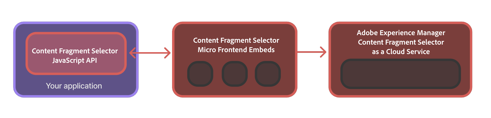

## Content Fragment Selector

Content Fragment Selector is a Content Fragments Console component from [Adobe Experience Manager as a Headless CMS][aem-headless] (AEM CS). This components follows the [Micro Frontend architecture][microfrontend-wiki] and is consumable in your application via convenient JavaScript APIs to search for, filter and select content fragments available in the AEM CS repository.

## Contents

- [What is this repository for](#what-is-this-repository-for)
- [Installation](#installation)
- [APIs](#apis)
  - [PureJSSelectors.`renderContentFragmentSelector` or `<ContentFragmentSelector/>`](#purejsselectorsrendercontentfragmentselector-or-contentfragmentselector)
  - [PureJSSelectors.`renderContentFragmentSelectorWithAuthFlow` or `<ContentFragmentSelectorWithAuthFlow/>`](#purejsselectorsrendercontentfragmentselectorwithauthflow-or-contentfragmentselectorwithauthflow-)
  - [PureJSSelectors.`registerContentFragmentSelectorAuthService`](#purejsselectorsregistercontentfragmentselectorauthservice)
- [Examples](#examples)
  - [JavaScript - UMD](#example---javascript)
  - [JavaScript - ESM](#example---importmap-via-esm-cdn)
  - [React](#example---react-with-importmap-via-esm-cdn)
- Supported Properties
  - [ContentFragmentSelector Props](./docs/ContentFragmentSelectorProps.md)
  - [ImsAuthProps](./docs/ImsAuthProps.md)
  - [ImsAuthService](./docs/ImsAuthService.md)
- [Contributing](#contributing)
- [Licensing](#licensing)

## What is this repository for

This GitHub repository contains usage examples for the Content Fragment Selectors' JavaScript APIs in various frameworks/libraries like Vanilla JavaScript and React. The JavaScript APIs enable you to conveniently integrate the Content Fragment Selector, which is a component from Adobe Experience Manager as a Headless CMS (AEM CS) into your application and support functions such as searching, browsing, filtering, selecting content fragments from the AEM CS repository and more.



## Installation

:warning: This repository is intended to serve as a supplemental documentation describing the available APIs and usage examples for integrating the Content Fragment Selector. Before attempting to install or use it, ensure that your organization has been provisioned to access the Content Fragment Selector as part of the Adobe Experience Manager as a Headless CMS (AEM CS) profile. If you have not been provisioned, you will not be able to successfully integrate or use these components. To request provisioning, your program admin should raise a support ticket marked as P2 from Admin Console and include the following information:

- Program ID and Environment ID for the AEM CS instance
- Domain names where the integrating application is hosted

After provisioning, your organization will be provided with an `imsClientId`, `imsScope`, and a `redirectUrl` corresponding to the environment that you request — which are essential for the configuration of the Content Fragment Selector to work end-to-end. Without those valid properties, you will not be able to integrate with the Content Fragment Selector. 

---
The Content Fragment Selector is available via the following installation options:

1. NPM Registry (Private Adobe Registry)

   * Add the following to `.npmrc`:

     ```html
     @aem-sites:registry=https://artifactory.corp.adobe.com/artifactory/api/npm/npm-aem-sites-release/
     ```

   * Then install

     ```html
     npm install @aem-sites/content-fragment-selector
     ```

2. Git Repository

   * Add the following to `package.json` dependencies:

     ```html
     "@aem-sites/content-fragment-selector": "git+https://github.com/adobe/private-repo-url.git#version"
     ```

And can be used in Deno/Webpack Module Federation like:
  ```html
  import { ContentFragmentSelector } from 'https://experience.adobe.com/solutions/CQ-content-fragments-selectors/static-content-fragments/resources/@content-fragments/selectors/index.js'
  ```

  or inside your adobe application like:
  ```html
  import { ContentFragmentSelector } from "@aem-sites/content-fragment-selector"
  ```

## APIs

This package exports the global identifier `PureJSSelectors` when installed via UMD and named exports `PureJSSelectors`. [`ContentFragmentSelector`](#purejsselectorsrendercontentfragmentselector-or-contentfragmentselector), [`ContentFragmentSelectorWithAuthFlow`](#purejsselectorsrendercontentfragmentselectorwithauthflow-or-contentfragmentselectorwithauthflow-), [`registerContentFragmentSelectorAuthService`](#purejsselectorsregistercontentfragmentselectorsauthservice) when installed via ESM. There are no default exports.

Below are the API description exported by this package in identifier `PureJSSelectors` and its equivalent JSX components that are available via ESM imports.
</br>

### PureJSSelectors.`renderContentFragmentSelector` or `<ContentFragmentSelector/>`

Renders the ContentFragmentSelector component on the provided container element and accepts all of the properties described in the [ContentFragmentSelector Props](./docs/ContentFragmentSelectorProps.md).

> This method assumes that you supply a valid _imsToken_ that you could have obtained using [`ImsAuthService.getImsToken()`](./docs/ImsAuthService.md) or another medium. If you do not have an _imsToken_, you can use [renderContentFragmentSelectorWithAuthFlow](#purejsselectorsrendercontentfragmentselectorwithauthflow-or-contentfragmentselectorwithauthflow-) which implements an authentication flow to obtain a user based _imsToken_.

###### Parameters

- `container` (`HTMLElement`) — render ContentFragmentSelector into the DOM in the supplied container
- `props` (`ContentFragmentSelectorProps`) — properties for the ContentFragmentSelector component. See [ContentFragmentSelector Props](./docs/ContentFragmentSelectorProps.md) for more details.
- `onRenderComplete` (`Function?`, default: `undefined`) — optional callback function that is invoked when the component is rendered or updated.

```js
PureJSSelectors.renderContentFragmentSelector(container: HTMLElement, props: ContentFragmentSelectorProps, onRenderComplete?: Function): void

// JSX

<ContentFragmentSelector {...props} />
```

### PureJSSelectors.`renderContentFragmentSelectorWithAuthFlow` or `<ContentFragmentSelectorWithAuthFlow />`

Renders the ContentFragmentSelector component on the provided container element and accepts all of the properties described in the [ContentFragmentSelector Props](./docs/ContentFragmentSelectorProps.md). The ContentFragmentSelectorWithAuthFlow component extends the ContentFragmentSelector component to include an authentication flow. When there's no _`imsToken`_ present, the ContentFragmentSelectorWithAuthFlow component will show a _Adobe_ login flow to obtain the _imsToken_ and then render the ContentFragmentSelector component.

> It is **recommended** that you call [_registerContentFragmentSelectorAuthService_](#purejsselectorsregistercontentfragmentselectorauthservice) on your page load before calling renderContentFragmentSelectorWithAuthFlow or `<ContentFragmentSelectorWithAuthFlow/>`. In the event where you cannot call _registerContentFragmentSelectorAuthService_,  you can supply [ImsAuthProps](./docs/ImsAuthProps.md) along with [ContentFragmentSelectorProps](./docs/ContentFragmentSelectorProps.md). However, that might not create a great user experience.

###### Parameters

- `container` (`HTMLElement`) — render ContentFragmentSelector into the DOM in the supplied container
- `props` (`ContentFragmentSelectorProps`) — properties for the ContentFragmentSelector component. See [ContentFragmentSelector Props](./docs/ContentFragmentSelectorProps.md) for more details.
- `onRenderComplete` (`Function?`, default: `undefined`) — optional callback function that is invoked when the component is rendered or updated.

```js
PureJSSelectors.renderContentFragmentSelectorWithAuthFlow(container: HTMLElement, props: ContentFragmentSelectorProps, onRenderComplete?: Function): void

// JSX

<ContentFragmentSelectorWithAuthFlow {...props} />
```

### PureJSSelectors.`registerContentFragmentSelectorAuthService`

Instantiates the [_ImsAuthService_](./docs/ImsAuthService.md) process. This process registers the authorization service for your AEM CS Content Fragments repository and subscribes to authorization flow events.

> It is recommended that you call this function on your application page load. You must also call this function if you're using the [ContentFragmentSelectorWithAuthFlow](#purejsselectorsrendercontentfragmentselectorwithauthflow-or-contentfragmentselectorwithauthflow-) component. This API is not required if you're using the [ContentFragmentSelector](#purejsselectorsrendercontentfragmentselector-or-contentfragmentselector) component and already obtained a valid _imsToken_.

##### Parameters

- `authProps` (`ImsAuthProps`) — required properties for the ImsAuthService. See [ImsAuthProps](./docs/ImsAuthProps.md) for more details.

##### Returns

- @returns (`ImsAuthService`) — an instance of the ImsAuthService. See [ImsAuthService](./docs/ImsAuthService.md) for more details.

```js
PureJSSelectors.registerContentFragmentSelectorAuthService(authProps: ImsAuthProps): ImsAuthService
```

## Examples

Content Fragment Selector repository allows you to integrate the ContentFragmentSelector component into your application using vanilla JavaScript and React. Below, are some examples of how you can make use of ContentFragmentSelector component into your application.

### Example - JavaScript

Content Fragment Selector UMD version exposes a global variable `PureJSSelectors` which exposes the Content Fragment Selector [APIs](#apis). Below is an example of how you can use the Content Fragment Selector component in your application using the built in auth flow. For a more complete and runnable code, refer to the [Vanilla JavaScript demo](./examples/vanilla-js)

#### ContentFragmentSelector Usage

```js
// 1. Include the CDN link in your script tag
<script src="https://experience-qa.adobe.com/solutions/CQ-sites-content-fragment-selector/static-assets/resources/content-fragment-selector.js"></script>

// 2. Register the Content Fragment Selector Auth Service on document load
// Note: it is recommended that you call registerContentFragmentSelectorAuthService before you call renderContentFragmentSelectorWithAuthFlow
PureJSSelectors.registerContentFragmentSelectorAuthService({
    imsClientId: '<IMS_CLIENT_ID_ASSOCIATED_WITH_YOUR_AEM_CS_REPOSITORY>',
    imsScope: 'AdobeID,openid,additional_info.projectedProductContext,read_organizations',
    redirectUri: window.location.href
});

// 3. Render the ContentFragmentSelector component with built in auth flow
const props = {
    imsOrg: "your-aem-cs-repository-ims-org",
    handleSelection: (fragments) => {
        ...
    }
}

PureJSSelectors.renderContentFragmentSelectorWithAuthFlow(document.getElementById('content-fragment-selector-container'), props);
```

```html
<!-- In your HTML file where ContentFragmentSelector will be rendered on to the container element -->
<div id="content-fragment-selector-container"></div>
```

### Example - React with importMap via ESM CDN

Content Fragment Selector ESM CDN version also exposes `ContentFragmentSelector`, `ContentFragmentSelectorWithAuthFlow` and `registerContentFragmentSelectorAuthService` React JSX components. It takes advantage of the browser's new [importMap][import-maps-wiki] feature. This feature allows you to define a mapping of import names to URLs. This is similar to how you would use a package manager like npm or yarn, but without the need for a build step.

> Note: if your project does not have React as a dependency, you will need to include React and ReactDOM in your importMap. For a more complete and runnable code, refer to the [React demo](./examples/react)

#### ContentFragmentSelector Usage

```js
// 1. Supply the browser with importMap specifier
<script type="importmap">
  {
    "imports": {
      "@aem-sites/content-fragment-selector": "https://experience-qa.adobe.com/solutions/CQ-sites-content-fragment-selector/static-assets/resources/@aem-sites/content-fragment-selector/index.js",
      "react": "https://esm.sh/react@18.2.0",
      "react-dom": "https://esm.sh/react-dom@18.2.0"
    }
  }
</script>

<script type="module">
  import React, { useEffect } from 'react';
  import { createRoot } from 'react-dom/client';

  // 2. Import the Content Fragment Selector components from the alias
  import { ContentFragmentSelectorWithAuthFlow, registerContentFragmentSelectorAuthService } from '@aem-sites/content-fragment-selector';

  const App = () => {
    // 3. Register the Content Fragment Selector Auth Service on component load
    // Note: it is recommended that you call registerContentFragmentSelectorAuthService before rendering ContentFragmentSelectorWithAuthFlow

    const imsAuthProps = {
        imsClientId: '<IMS_CLIENT_ID_ASSOCIATED_WITH_YOUR_AEM_CS_REPOSITORY>',
        imsScope: 'AdobeID,openid,additional_info.projectedProductContext,read_organizations',
        redirectUri: window.location.href
    };

    useEffect(() => {
        registerContentFragmentSelectorAuthService(imsAuthProps);
    }, []);

    // 4. Return and render the ContentFragmentSelector component with built in auth flow
    const props = {
        imsOrg: "your-aem-cs-repository-ims-org",
        handleSelection: (fragments) => {
            ...
        }
    }

    return <ContentFragmentSelectorWithAuthFlow {...props} />;
}

const root = createRoot(document.getElementById('root'));
root.render(<App />);
  
</script>
```
#### `ContentFragmentSelector` react component usage

```javascript
const TestComponent = (args) => {
    const repoId = args.repoId ?? "author-p77504-e175976-cmstg.adobeaemcloud.com";
    const orgId = args.orgId ?? "8C6043F15F43B6390A49401A@AdobeOrg";
    const [isOpen, setIsOpen] = React.useState(false);
    const { imsOrg, imsToken } = serviceConfig.getAuth() || {};

    return (
      <DialogTrigger type="fullscreen" isOpen={isOpen}>
          <ActionButton onPress={() => setIsOpen(true)}>Show Fragment Selector</ActionButton>
          <ContentFragmentSelector
              ref={selectorInstance}
              imsToken={imsToken}
              repoId={repoId}
              {...(args?.defaultRepoId && {
                  defaultRepoId: args?.defaultRepoId,
              })}
              orgId={orgId}
              locale={args?.locale ?? shellData.locale ?? "en-US"}
              env={env}
              filters={
                  args.filters ?? {
                      folder: "/content/dam",
                      status: [
                          ContentFragmentStatusGa.PUBLISHED,
                          ContentFragmentStatusGa.MODIFIED,
                      ],
                      tag: [
                          {
                              id: "1:",
                              name: "1",
                          },
                      ],
                  }
              }
              isOpen={isOpen}
              noWrap={false}
              theme={args?.theme ?? "light"}
              selectionType={"multiple"}
              {...(args.dialogSize && {
                  dialogSize: args.dialogSize,
              })}
              runningInUnifiedShell={args.runningInUnifiedShell ?? true}
              readonlyFilters={
                  args.readonlyFilters ?? [
                      {
                          tag: [
                              {
                                  id: "1:",
                                  name: "1",
                              },
                          ],
                      },
                  ]
              }
              selectedFragments={args.selectedFragments ?? []}
              hipaaEnabled={args?.hipaaEnabled ?? false}
              inventoryView={args.inventoryView}
              inventoryViewToggleEnabled={
                  args.inventoryViewToggleEnabled ?? false
              }
              onDismiss={() => setIsOpen(false)}
              onSubmit={(data) => console.log("On Submit payload:", data)}
              onSelectionChange={(data) => {
                  console.log("On selection change payload:", data);
              }}
          />
      </DialogTrigger>
    );
};
```

Example with imsAuthService:

```javascript
const TestComponent = (args) => {
    const orgId = "8C6043F15F43B6390A49401A@AdobeOrg";
    const repoId = args.repoId ?? "author-p77504-e175976-cmstg.adobeaemcloud.com";
    const [isOpen, setIsOpen] = React.useState(false);
    
    const imsSusiData = {
        imsClientId: "exc_app",
        imsScope:
            "AdobeID,openid,read_organizations,additional_info.projectedProductContext",
        redirectUrl: window.location.href,
        adobeImsOptions: {
            useLocalStorage: true,
        },
        modalMode: true,
        env: args?.env || ("PROD" as Env),
    };

    const { imsAuthService } = useImsAuthFlow({ ...imsSusiData });

    return (
        <DialogTrigger type="fullscreen" isOpen={isOpen}>
            <ActionButton
                onPress={async () => {
                    try {
                        await imsAuthService?.triggerAuthFlow().then(() => {
                            setIsOpen(true);
                        });
                    } catch (error) {
                        console.error("Error signing in: ", error);
                    }
                }}
            >
                Show Selector
            </ActionButton>
            <ContentFragmentSelectorWithAuthFlow
                repoId={repoId}
                {...(args?.defaultRepoId && {
                    defaultRepoId: args?.defaultRepoId,
                })}
                orgId={orgId}
                locale={args?.locale ?? shellData.locale ?? "en-US"}
                env={env}
                filters={
                    args.filters ?? {
                        folder: "/content/dam",
                        status: [
                            ContentFragmentStatusGa.PUBLISHED,
                            ContentFragmentStatusGa.MODIFIED,
                        ],
                        tag: [
                            {
                                id: "1:",
                                name: "1",
                            },
                        ],
                    }
                }
                isOpen={isOpen}
                noWrap={false}
                theme={args?.theme ?? "light"}
                selectionType={"multiple"}
                {...(args.dialogSize && {
                    dialogSize: args.dialogSize,
                })}
                runningInUnifiedShell={args.runningInUnifiedShell ?? true}
                readonlyFilters={
                    args.readonlyFilters ?? [
                        {
                            tag: [
                                {
                                    id: "1:",
                                    name: "1",
                                },
                            ],
                        },
                    ]
                }
                selectedFragments={args.selectedFragments ?? []}
                hipaaEnabled={args?.hipaaEnabled ?? false}
                inventoryView={args.inventoryView}
                inventoryViewToggleEnabled={
                    args.inventoryViewToggleEnabled ?? false
                }
                onDismiss={() => setIsOpen(false)}
                onSubmit={(data) => console.log("On Submit payload:", data)}
                onSelectionChange={(data) => {
                    console.log("On selection change payload:", data);
                }}
            />
        </DialogTrigger>
    );
};
```

### Accepted `props`

| Name                      |                     Type                      |                                                                                                                                                                                                                     Description                                                                                                                                                                                                                     |
|:--------------------------|:---------------------------------------------:|-----------------------------------------------------------------------------------------------------------------------------------------------------------------------------------------------------------------------------------------------------------------------------------------------------------------------------------------------------------------------------------------------------------------------------------------------------:|
| `ref`                     | [FragmentSelectorRef][FragmentSelectorRefURL] | Reference to the `ContentFragmentSelector` instance, allowing access to provided functionality such as `reload`.                                                                                                                                                                                                                                                                                              |
| `imsToken`                |                   string                      | IMS token used for authentication. If not provided, the IMS login flow will be initiated.                                                                                                                                                                                                                                                                                                                    |
| `repoId`                  |                   string                      | Repository ID used for the Fragment Selector. When provided, the selector automatically connects to the specified repository, and the repository dropdown is hidden. If not provided, the user can select a repository from the list of available repositories they have access to.                                                                                                                           |
| `defaultRepoId`           |                   string                      | Repository ID that will be selected by default when the repository selector is shown. Used only when `repoId` is not provided. If `repoId` is set, the repository selector is hidden, and this value is ignored.                                                                                                                                                                                              |
| `orgId`                   |                   string                      | Organization ID used for authentication. If not provided, the user can select a repository from different organizations they have access to. If the user doesn't have access to any repository or organization, the content will not be loaded.                                                                                                                                                                |
| `locale`                  |                   string                      | Locale.                                                                                                                                                                                                                                                                                                                                                                                                       |
| `env`                     |                   string                      | Deployment environment. See the `Env` type for allowed environment names.                                                                                                                                                                                                                                                                                                                                    |
| `filters`                 |   [FragmentFilter][FragmentFilterURL]         | Filters to be applied to the list of content fragments. By default, fragments under `/content/dam` will be displayed. Default value: `{ folder: "/content/dam" }`.                                                                                                                                                                                                                                           |
| `isOpen`                  |                   boolean                     | Flag to control whether the selector is open or closed.                                                                                                                                                                                                                                                                                                                                                       |
| `noWrap`                  |                   boolean                     | Determines whether the Fragment Selector is rendered without a wrapping dialog. When set to `true`, the Fragment Selector is embedded directly in the parent container. Useful for integrating the selector into custom layouts or workflows. Default: `false`.                                                                                                                                               |
| `onSelectionChange`       | ({ contentFragments: `ContentFragmentSelection`, domainName?: `string`, tenantInfo?: `string`, repoId?: `string`, deliveryRepos?: `DeliveryRepository[]` }) => void | Callback function triggered whenever the selection of content fragments changes. Provides the currently selected fragments, domain name, tenant info, repository ID, and delivery repositories.                                                                                                                                                                                                               |
| `onDismiss`               |                () => void                     | Callback function triggered when the dismiss action is performed (e.g., closing the selector).                                                                                                                                                                                                                                                                                                               |
| `onSubmit`                | ({ contentFragments: `ContentFragmentSelection`, domainName?: `string`, tenantInfo?: `string`, repoId?: `string`, deliveryRepos?: `DeliveryRepository[]` }) => void | Callback function triggered when the user confirms their selection. Receives the selected content fragments, domain name, tenant info, repository ID, and delivery repositories.                                                                                                                                                                                                                              |
| `theme`                   |             `"light" | "dark"`              | Theme for the Fragment Selector. By default, it is set to the unifiedShell environment theme.                                                                                                                                                                                                                                                                                                                |
| `selectionType`           |             `"single" | "multiple"`          | Selection type can be used to restrict selection for the Fragment Selector. Default: `single`.                                                                                                                                                                                                                                                                                                               |
| `dialogSize`              | `"fullscreen" | "fullscreenTakeover"` | Optional prop to control the dialog size. Default: `fullscreen`.                                                                                                                                                                                                                                                                                                                                             |
| `runningInUnifiedShell`   |                   boolean                     | Whether DestinationSelector is running under UnifiedShell or standalone.                                                                                                                                                                                                                                                                                                                                      |
| `readonlyFilters`         |   ResourceReadonlyFiltersField[]              | Read-only filters applied to the list of content fragments. These filters cannot be removed by the user.                                                                                                                                                                                                                                                                                                     |
| `selectedFragments`       |   ContentFragmentIdentifier[]                | Initial selection of content fragments to be pre-selected when the selector opens.                                                                                                                                                                                                                                                                                                                            |
| `hipaaEnabled`            |                   boolean                     | Indicates whether HIPAA compliance is enabled. Default: `false`.                                                                                                                                                                                                                                                                                                                                              |
| `inventoryView`           |          `InventoryViewType`                 | Inventory default view type to be used in the selector. Default: `table`.                                                                                                                                                                                                                                                                                                                                     |
| `inventoryViewToggleEnabled` |                boolean                     | Indicates whether the inventory view toggle is enabled, allowing the user to switch between table and grid views. Default: `false`.    
<br/>

### Contributing

Contributions are welcomed! Read the [Contributing Guide](./.github/CONTRIBUTING.md) for more information.

### Licensing

This project is licensed under the Apache V2 License. See [LICENSE](LICENSE) for more information.

<!-- links -->
[aem-headless]: https://experienceleague.adobe.com/en/docs/experience-manager-cloud-service/content/headless/introduction
[microfrontend-wiki]: https://en.wikipedia.org/wiki/Microfrontend
[import-maps-wiki]: https://github.com/WICG/import-maps
