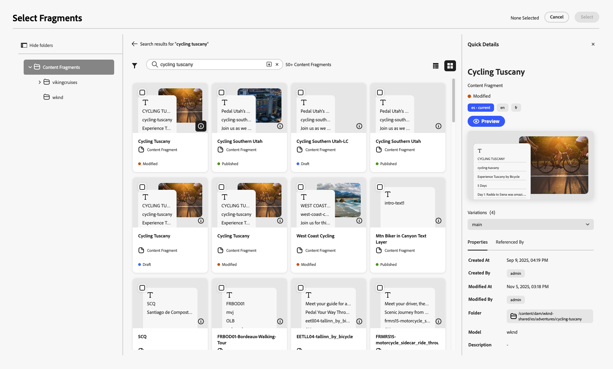

## Content Fragment Selector

Content Fragment Selector is a Content Fragments Console component from [Adobe Experience Manager as a Headless CMS][aem-headless] (AEM CS). This components follows the [Micro Frontend architecture][microfrontend-wiki] and is consumable in your application via convenient JavaScript APIs to search for, filter and select content fragments available in the AEM CS repository.

## Contents

- [What is this repository for](#what-is-this-repository-for)
- [Installation](#installation)
- [APIs](#apis)
  - [PureJSContentFragmentSelectors.`renderContentFragmentSelector` or `<ContentFragmentSelector/>`](#purejscontentfragmentselectorsrendercontentfragmentselector-or-contentfragmentselector)
  - [PureJSContentFragmentSelectors.`renderContentFragmentSelectorWithAuthFlow` or `<ContentFragmentSelectorWithAuthFlow/>`](#purejscontentfragmentselectorsrendercontentfragmentselectorwithauthflow-or-contentfragmentselectorwithauthflow-)
  - [PureJSContentFragmentSelectors.`registerContentFragmentSelectorAuthService`](#purejscontentfragmentselectorsregistercontentfragmentselectorauthservice)
- [Examples](#examples)
  - [JavaScript - UMD](#example---javascript)
  - [JavaScript - ESM](#example---importmap-via-esm-cdn)
  - [React](#example---react-with-importmap-via-esm-cdn)
- Supported Properties
  - [ContentFragmentSelector Props](./docs/ContentFragmentSelectorProps.md)
  - [ContentFragmentSelection Type](./docs/ContentFragmentSelection.md)
  - [ImsAuthProps](./docs/ImsAuthProps.md)
  - [ImsAuthService](./docs/ImsAuthService.md)
- [Contributing](#contributing)
- [Licensing](#licensing)

## What is this repository for

This GitHub repository contains usage examples for the Content Fragment Selectors' JavaScript APIs in various frameworks/libraries like Vanilla JavaScript and React. The JavaScript APIs enable you to conveniently integrate the Content Fragment Selector, which is a component from Adobe Experience Manager as a Headless CMS (AEM CS) into your application and support functions such as searching, browsing, filtering, selecting content fragments from the AEM CS repository and more.



## Installation

:warning: This repository is intended to serve as a supplemental documentation describing the available APIs and usage examples for integrating the Content Fragment Selector. Before attempting to install or use it, ensure that your organization has been provisioned to access the Content Fragment Selector as part of the Adobe Experience Manager as a Headless CMS (AEM CS) profile. If you have not been provisioned, you will not be able to successfully integrate or use these components. To request provisioning, your program admin should raise a support ticket marked as P2 from Admin Console and include the following information:

- Program ID and Environment ID for the AEM CS instance
- Domain names where the integrating application is hosted

After provisioning, your organization will be provided with an `imsClientId`, `imsScope`, and a `redirectUrl` corresponding to the environment that you request — which are essential for the configuration of the Content Fragment Selector to work end-to-end. Without those valid properties, you will not be able to integrate with the Content Fragment Selector. 

---
The Content Fragment Selector is available via the following installation options:

1. NPM Package

   ```bash
   npm install @aem-sites/content-fragment-selector
   ```

2. And can be used in Deno/Webpack Module Federation like:

   ```js
   import { ContentFragmentSelector } from 'https://experience.adobe.com/solutions/CQ-content-fragments-selectors/static-content-fragments/resources/@content-fragments/selectors/index.js'
   ```

   or inside your Adobe application like:

   ```js
   import { ContentFragmentSelector } from "@aem-sites/content-fragment-selector"
   ```

> **Breaking Change (v4.0.0+):** The UMD build global object name has changed from `PureJSSelectors` to `PureJSContentFragmentSelectors` to avoid conflicts when using both MFE Assets and Content Fragment Selector in the same app. This is a breaking change only for consumers using the UMD build via script tag. ES module imports (React, Angular) are not affected. If you're upgrading from version 3.x or earlier, update your code to use `window.PureJSContentFragmentSelectors` instead of `window.PureJSSelectors`.

> **Note:** Starting with version 3.0.0, support for `ContentFragmentViewer` has been removed.
> You can use `ContentFragmentSelector` with `noWrap=true` as a replacement.

## APIs

This package exports the global identifier `PureJSContentFragmentSelectors` when installed via UMD and named exports [`ContentFragmentSelector`](#purejscontentfragmentselectorsrendercontentfragmentselector-or-contentfragmentselector), [`ContentFragmentSelectorWithAuthFlow`](#purejscontentfragmentselectorsrendercontentfragmentselectorwithauthflow-or-contentfragmentselectorwithauthflow-), [`registerContentFragmentSelectorAuthService`](#purejscontentfragmentselectorsregistercontentfragmentselectorauthservice) when installed via ESM. There are no default exports.

Below are the API description exported by this package in identifier `PureJSContentFragmentSelectors` and its equivalent JSX components that are available via ESM imports.
</br>

### PureJSContentFragmentSelectors.`renderContentFragmentSelector` or `<ContentFragmentSelector/>`

Renders the ContentFragmentSelector component on the provided container element and accepts all of the properties described in the [ContentFragmentSelector Props](./docs/ContentFragmentSelectorProps.md).

> This method assumes that you supply a valid _imsToken_ that you could have obtained using [`ImsAuthService.getImsToken()`](./docs/ImsAuthService.md) or another medium. If you do not have an _imsToken_, you can use [renderContentFragmentSelectorWithAuthFlow](#purejscontentfragmentselectorsrendercontentfragmentselectorwithauthflow-or-contentfragmentselectorwithauthflow-) which implements an authentication flow to obtain a user based _imsToken_.

###### Parameters

- `container` (`HTMLElement`) — render ContentFragmentSelector into the DOM in the supplied container
- `props` (`ContentFragmentSelectorProps`) — properties for the ContentFragmentSelector component. See [ContentFragmentSelector Props](./docs/ContentFragmentSelectorProps.md) for more details.
- `onRenderComplete` (`Function?`, default: `undefined`) — optional callback function that is invoked when the component is rendered or updated.

```js
PureJSContentFragmentSelectors.renderContentFragmentSelector(container: HTMLElement, props: ContentFragmentSelectorProps, onRenderComplete?: Function): void

// JSX

<ContentFragmentSelector {...props} />
```

### PureJSContentFragmentSelectors.`renderContentFragmentSelectorWithAuthFlow` or `<ContentFragmentSelectorWithAuthFlow />`

Renders the ContentFragmentSelector component on the provided container element and accepts all of the properties described in the [ContentFragmentSelector Props](./docs/ContentFragmentSelectorProps.md). The ContentFragmentSelectorWithAuthFlow component extends the ContentFragmentSelector component to include an authentication flow. When there's no _`imsToken`_ present, the ContentFragmentSelectorWithAuthFlow component will show a _Adobe_ login flow to obtain the _imsToken_ and then render the ContentFragmentSelector component.

> It is **recommended** that you call [_registerContentFragmentSelectorAuthService_](#purejscontentfragmentselectorsregistercontentfragmentselectorauthservice) on your page load before calling renderContentFragmentSelectorWithAuthFlow or `<ContentFragmentSelectorWithAuthFlow/>`. In the event where you cannot call _registerContentFragmentSelectorAuthService_,  you can supply [ImsAuthProps](./docs/ImsAuthProps.md) along with [ContentFragmentSelectorProps](./docs/ContentFragmentSelectorProps.md). However, that might not create a great user experience.

###### Parameters

- `container` (`HTMLElement`) — render ContentFragmentSelector into the DOM in the supplied container
- `props` (`ContentFragmentSelectorProps`) — properties for the ContentFragmentSelector component. See [ContentFragmentSelector Props](./docs/ContentFragmentSelectorProps.md) for more details.
- `onRenderComplete` (`Function?`, default: `undefined`) — optional callback function that is invoked when the component is rendered or updated.

```js
PureJSContentFragmentSelectors.renderContentFragmentSelectorWithAuthFlow(container: HTMLElement, props: ContentFragmentSelectorProps, onRenderComplete?: Function): void

// JSX

<ContentFragmentSelectorWithAuthFlow {...props} />
```

### PureJSContentFragmentSelectors.`registerContentFragmentSelectorAuthService`

Instantiates the [_ImsAuthService_](./docs/ImsAuthService.md) process. This process registers the authorization service for your AEM CS Content Fragments repository and subscribes to authorization flow events.

> It is recommended that you call this function on your application page load. You must also call this function if you're using the [ContentFragmentSelectorWithAuthFlow](#purejscontentfragmentselectorsrendercontentfragmentselectorwithauthflow-or-contentfragmentselectorwithauthflow-) component. This API is not required if you're using the [ContentFragmentSelector](#purejscontentfragmentselectorsrendercontentfragmentselector-or-contentfragmentselector) component and already obtained a valid _imsToken_.

##### Parameters

- `authProps` (`ImsAuthProps`) — required properties for the ImsAuthService. See [ImsAuthProps](./docs/ImsAuthProps.md) for more details.

##### Returns

- @returns (`ImsAuthService`) — an instance of the ImsAuthService. See [ImsAuthService](./docs/ImsAuthService.md) for more details.

```js
PureJSContentFragmentSelectors.registerContentFragmentSelectorAuthService(authProps: ImsAuthProps): ImsAuthService
```

## Examples

Content Fragment Selector repository allows you to integrate the ContentFragmentSelector component into your application using vanilla JavaScript and React. Below, are some examples of how you can make use of ContentFragmentSelector component into your application.

### Example - JavaScript

Content Fragment Selector UMD version exposes a global variable `PureJSContentFragmentSelectors` which exposes the Content Fragment Selector [APIs](#apis). Below is an example of how you can use the Content Fragment Selector component in your application using the built in auth flow. For a more complete and runnable code, refer to the [Vanilla JavaScript demo](./examples/vanilla-js)

#### ContentFragmentSelector Usage

```js
// 1. Include the CDN link in your script tag
<script src="https://experience.adobe.com/solutions/CQ-sites-content-fragment-selector/static-assets/resources/content-fragment-selector.js"></script>

// 2. Register the Content Fragment Selector Auth Service on document load
// Note: it is recommended that you call registerContentFragmentSelectorAuthService before you call renderContentFragmentSelectorWithAuthFlow
PureJSContentFragmentSelectors.registerContentFragmentSelectorAuthService({
    imsClientId: '<IMS_CLIENT_ID_ASSOCIATED_WITH_YOUR_AEM_CS_REPOSITORY>',
    imsScope: 'AdobeID,openid,additional_info.projectedProductContext,read_organizations',
    redirectUri: window.location.href
});

// 3. Render the ContentFragmentSelector component with built in auth flow
const props = {
    orgId: "your-aem-cs-repository-ims-org",
    onSubmit: ({ contentFragments, domainName, repoId, deliveryRepos }) => {
        // contentFragments is of type ContentFragmentSelection
        contentFragments.forEach(fragment => {
            console.log('Fragment ID:', fragment.id);
            console.log('Fragment Path:', fragment.path);
            console.log('Fragment Title:', fragment.title);
        });
    }
}

PureJSContentFragmentSelectors.renderContentFragmentSelectorWithAuthFlow(document.getElementById('content-fragment-selector-container'), props);
```

```html
<!-- In your HTML file where ContentFragmentSelector will be rendered on to the container element -->
<div id="content-fragment-selector-container"></div>
```

### Example - ImportMap via ESM CDN

Content Fragment Selector ESM CDN version also exposes `ContentFragmentSelector`, `ContentFragmentSelectorWithAuthFlow` and `registerContentFragmentSelectorAuthService` React JSX components. It takes advantage of the browser's new [importMap][import-maps-wiki] feature. This feature allows you to define a mapping of import names to URLs. This is similar to how you would use a package manager like npm or yarn, but without the need for a build step.

> Note: if your project does not have React as a dependency, you will need to include React and ReactDOM in your importMap. For a more complete and runnable code, refer to the [React demo](./examples/react)

#### ContentFragmentSelector Usage

```js
// 1. Supply the browser with importMap specifier
<script type="importmap">
  {
    "imports": {
      "@aem-sites/content-fragment-selector": "https://experience.adobe.com/solutions/CQ-sites-content-fragment-selector/static-assets/resources/@aem-sites/content-fragment-selector/index.js",
      "react": "https://esm.sh/react@18.2.0",
      "react-dom": "https://esm.sh/react-dom@18.2.0"
    }
  }
</script>

<script type="module">
  import React, { useEffect } from 'react';
  import { createRoot } from 'react-dom/client';

  // 2. Import the Content Fragment Selector components from the alias
  import { ContentFragmentSelectorWithAuthFlow, registerContentFragmentSelectorAuthService } from '@aem-sites/content-fragment-selector';

  const App = () => {
    // 3. Register the Content Fragment Selector Auth Service on component load
    // Note: it is recommended that you call registerContentFragmentSelectorAuthService before rendering ContentFragmentSelectorWithAuthFlow

    const imsAuthProps = {
        imsClientId: '<IMS_CLIENT_ID_ASSOCIATED_WITH_YOUR_AEM_CS_REPOSITORY>',
        imsScope: 'AdobeID,openid,additional_info.projectedProductContext,read_organizations',
        redirectUri: window.location.href
    };

    useEffect(() => {
        registerContentFragmentSelectorAuthService(imsAuthProps);
    }, []);

    // 4. Return and render the ContentFragmentSelector component with built in auth flow
    const props = {
        orgId: "your-aem-cs-repository-ims-org",
        onSubmit: ({ contentFragments, domainName, repoId, deliveryRepos }) => {
            contentFragments.forEach(fragment => {
                console.log('Fragment:', fragment.title, fragment.path);
            });
        }
    }

    return <ContentFragmentSelectorWithAuthFlow {...props} />;
}

const root = createRoot(document.getElementById('root'));
root.render(<App />);
  
</script>
```

### Example - React with ImportMap via ESM CDN

#### `ContentFragmentSelector` React Component Usage

```javascript
const TestComponent = () => {
    const repoId = "author-p77504-e175976-cmstg.adobeaemcloud.com";
    const orgId = "8C6043F15F43B6390A49401A@AdobeOrg";
    const [isOpen, setIsOpen] = React.useState(false);
    const { imsOrg, imsToken } = serviceConfig.getAuth() || {};
    const selectorInstance = useRef();
    
    // Use this function as callback for buttons or other events to trigger reload of Fragments Table
    const reload = useCallback(() => {
        selectorInstance?.current?.reload?.();
    }, [selectorInstance]);

    return (
        <DialogTrigger type="fullscreen" isOpen={isOpen}>
            <ActionButton onPress={() => setIsOpen(true)}>Show Fragment Selector</ActionButton>
            <ContentFragmentSelector
                ref={selectorInstance}
                orgId={imsOrg}
                imsToken={imsToken}
                repoId={repoId}
                allowedRepositoryIds={["author-p77504-e175976-cmstg.adobeaemcloud.com", "author-p12345-e67890-prod.adobeaemcloud.com"]}
                defaultRepoId="default-repo-id"
                locale="en-US"
                env="PROD"
                isOpen={isOpen}
                filters={{
                    folder: "/content/dam",
                    status: ["PUBLISHED", "MODIFIED"],
                    tag: [
                            {
                                id: "1:",
                                name: "1",
                                path: "/content/cq:tags/1",
                                description: "",
                            },
                        ],
                }}
                readonlyFilters={[
                    { status: ["PUBLISHED", "MODIFIED"] },
                    {
                        tag: [
                            {
                                id: "1:",
                                name: "1",
                            },
                        ],
                    },
                ]}
                selectedFragments={[
                    { id: "fragment1", path: "/content/dam/fragment1" },
                ]}
                noWrap={false}
                theme="light"
                selectionType="multiple"
                dialogSize="fullscreen"
                hipaaEnabled={false}
                inventoryView="table"
                inventoryViewToggleEnabled={true}
                onDismiss={() => setIsOpen(false)}
                onSubmit={({ contentFragments, domainName, tenantInfo, repoId, deliveryRepos }) =>
                    console.log("On Submit payload:", { contentFragments, domainName, tenantInfo, repoId, deliveryRepos })
                }
                onSelectionChange={({ contentFragments, domainName, tenantInfo, repoId, deliveryRepos }) => {
                    console.log("On selection change payload:", { contentFragments, domainName, tenantInfo, repoId, deliveryRepos });
                }}
            />
        </DialogTrigger>
    );
};
```

#### `ContentFragmentSelectorWithAuthFlow` React Component Usage

```javascript
const TestComponent = () => {
    const repoId = "author-p77504-e175976-cmstg.adobeaemcloud.com";
    const orgId = "8C6043F15F43B6390A49401A@AdobeOrg";
    const [isOpen, setIsOpen] = React.useState(false);
    
    const imsSusiData = {
        imsClientId: "exc_app",
        imsScope:
            "AdobeID,openid,read_organizations,additional_info.projectedProductContext",
        redirectUrl: window.location.href,
        adobeImsOptions: {
            useLocalStorage: true,
        },
        modalMode: true,
        env: "PROD",
    };

    const { imsAuthService } = useImsAuthFlow({ ...imsSusiData });

    return (
        <DialogTrigger type="fullscreen" isOpen={isOpen}>
                <ActionButton
                    onPress={async () => {
                        try {
                            await imsAuthService?.triggerAuthFlow().then(() => {
                                setIsOpen(true);
                            });
                        } catch (error) {
                            console.error("Error signing in: ", error);
                        }
                    }}
                >
                    Show Selector
                </ActionButton>
                <ContentFragmentSelectorWithAuthFlow
                    repoId={repoId}
                    allowedRepositoryIds={["author-p77504-e175976-cmstg.adobeaemcloud.com", "author-p12345-e67890-prod.adobeaemcloud.com"]}
                    defaultRepoId="default-repo-id"
                    orgId={orgId}
                    locale="en-US"
                    env="PROD"
                    isOpen={isOpen}
                    filters={{
                        folder: "/content/dam",
                        status: ["PUBLISHED", "MODIFIED"],
                        tag: [
                            {
                                id: "1:",
                                name: "1",
                                path: "/content/cq:tags/1",
                                description: "",
                            },
                        ],
                    }}
                    readonlyFilters={[
                        { status: ["PUBLISHED", "MODIFIED"] },
                        {
                            tag: [
                                {
                                    id: "1:",
                                    name: "1",
                                },
                            ],
                        },
                    ]}
                    selectedFragments={[
                        { id: "fragment1", path: "/content/dam/fragment1" },
                    ]}
                    noWrap={false}
                    theme="light"
                    selectionType="multiple"
                    dialogSize="fullscreen"
                    hipaaEnabled={false}
                    inventoryView="table"
                    inventoryViewToggleEnabled={true}
                    onDismiss={() => setIsOpen(false)}
                    onSubmit={({ contentFragments, domainName, tenantInfo, repoId, deliveryRepos }) =>
                        console.log("On Submit payload:", { contentFragments, domainName, tenantInfo, repoId, deliveryRepos })
                    }
                    onSelectionChange={({ contentFragments, domainName, tenantInfo, repoId, deliveryRepos }) => {
                        console.log("On selection change payload:", { contentFragments, domainName, tenantInfo, repoId, deliveryRepos });
                    }}
                />
            </DialogTrigger>
    );
};
```

### ContentFragmentSelection Structure

When fragments are selected, the `onSubmit` and `onSelectionChange` callbacks receive an object containing an array of `ContentFragmentSelection` items along with additional metadata.

For complete type definitions and properties, see [ContentFragmentSelection Type Documentation](./docs/ContentFragmentSelection.md).

### Accepted `props`

For a complete and up-to-date list of all supported properties, their types, defaults, and descriptions, see the [Content Fragment Selector Props documentation](./docs/ContentFragmentSelectorProps.md).

<br/>

### Contributing

Contributions are welcomed! Read the [Contributing Guide](./.github/CONTRIBUTING.md) for more information.

### Licensing

This project is licensed under the Apache V2 License. See [LICENSE](LICENSE) for more information.

<!-- links -->
[aem-headless]: https://experienceleague.adobe.com/en/docs/experience-manager-cloud-service/content/headless/introduction
[microfrontend-wiki]: https://en.wikipedia.org/wiki/Microfrontend
[import-maps-wiki]: https://github.com/WICG/import-maps
